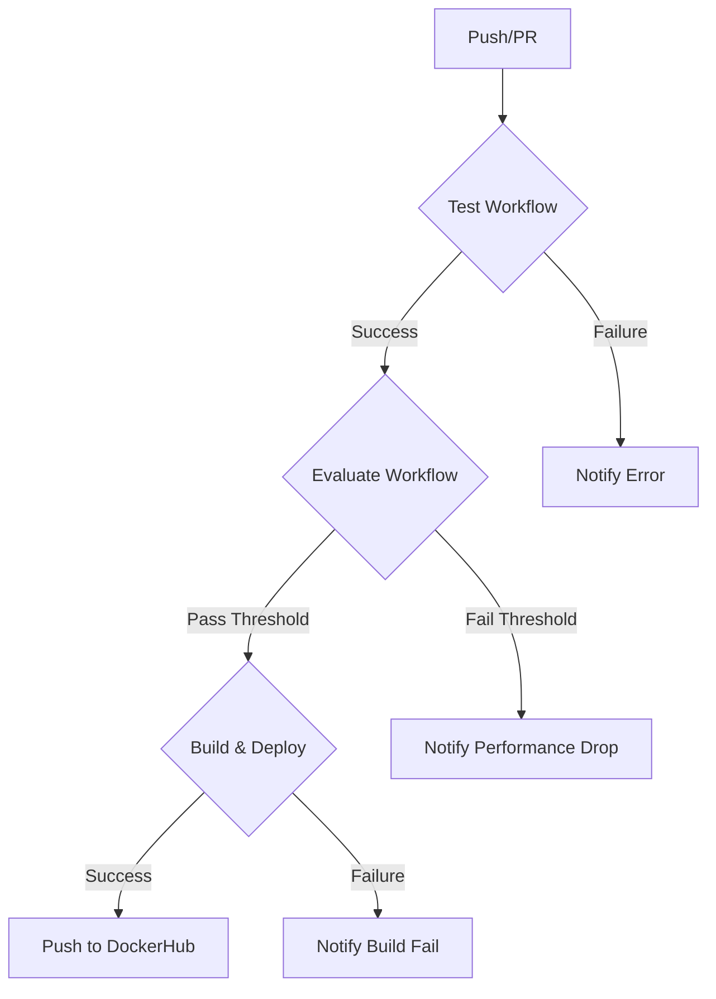

# 📑 Project Report: MLOps Pipeline for Sentiment Analysis

**Team Members:** Nivid DESAI & Shreya PALLISSERY
**GitHub Repository:** [https://github.com/NividDESAI/sentiment-bert-collab](https://github.com/NividDESAI/sentiment-bert-collab)

## 1. Executive Summary

This report documents the implementation of a robust MLOps pipeline for the BERT-based sentiment analysis system. The project successfully integrates containerization, automated testing, continuous integration/deployment (CI/CD), and real-time monitoring to ensure a production-ready lifecycle for the machine learning model.

## 2. MLOps Architecture

The architecture follows industry best practices for MLOps, ensuring reproducibility, scalability, and reliability.

### 2.1 Containerization (Docker)

We utilized **Docker** to containerize the application, ensuring consistency across development, testing, and production environments.

- **Multi-stage Build**: The `Dockerfile` uses a multi-stage approach:
  - **Builder Stage**: Installs build dependencies and compiles requirements.
  - **Runtime Stage**: Copies only necessary artifacts to a slim Python image, reducing image size and improving security.
- **Services**:
  - `sentiment-api`: The core FastAPI application serving the model.
  - `mongodb`: Persists prediction logs for auditing and analysis.
  - `redis`: Caches frequent predictions to reduce latency.
  - `prometheus` & `grafana`: Provides real-time monitoring and visualization.

### 2.2 Orchestration (Docker Compose)

`docker-compose.yml` orchestrates the multi-container application, defining:
- **Networking**: A dedicated bridge network (`sentiment-network`) for secure communication between services.
- **Volumes**: Persistent storage for models (`models-data`), training data (`training-data`), and logs (`mongo-data`).
- **Health Checks**: Automated health checks ensure services are ready before traffic is routed.

## 3. CI/CD Pipeline (GitHub Actions)

We implemented a 3-stage automated pipeline using GitHub Actions.

### Workflow Diagram

### Stage 1: Continuous Integration (`test.yml`)
- **Trigger**: Runs on every push and pull request.
- **Tasks**:
  - Sets up Python environment.
  - Installs dependencies.
  - **Linting**: Checks code quality using `ruff` and `black`.
  - **Testing**: Runs unit and integration tests with `pytest`.
  - **Coverage**: Verifies 100% code coverage.

*(Screenshot of successful test run)*

### Stage 2: Continuous Evaluation (`evaluate.yml`)
- **Trigger**: Runs after successful completion of the Test workflow.
- **Tasks**:
  - Loads the trained model.
  - Evaluates performance on a hold-out test set.
  - **Threshold Check**: Fails the pipeline if Accuracy or F1 Score drops below 0.80.
  - **Artifacts**: Saves confusion matrix and metrics report.

*(Screenshot of evaluation metrics and artifacts)*

### Stage 3: Continuous Deployment (`build.yml`)
- **Trigger**: Runs after successful evaluation.
- **Tasks**:
  - Builds the Docker image.
  - **Security Scan**: Scans image for vulnerabilities using Trivy.
  - **Publish**: Pushes the tagged image to Docker Hub.

*(Screenshot of docker build and push)*

## 4. Technical Choices & Justification

| Component | Choice | Justification |
|-----------|--------|---------------|
| **Framework** | FastAPI | High performance, native async support, and automatic OpenAPI documentation. |
| **Container** | Docker | Standard for containerization, ensures "write once, run anywhere". |
| **CI/CD** | GitHub Actions | Native integration with repository, free tier availability, and extensive marketplace actions. |
| **Monitoring** | Prometheus/Grafana | Industry standard for metrics collection and visualization. |
| **Database** | MongoDB | Flexible schema for storing unstructured prediction logs. |
| **Cache** | Redis | High-performance in-memory store for caching predictions. |

## 5. Challenges & Solutions

- **Model Size**: BERT models are large. We used Docker volumes to persist models outside the container to keep image size manageable.
- **Dependency Management**: We used a multi-stage Docker build to separate build-time dependencies (gcc, etc.) from runtime dependencies, significantly reducing image size.
- **Latency**: Inference can be slow on CPU. We implemented Redis caching to serve repeated requests instantly.

## 6. Conclusion

The implemented MLOps pipeline transforms the standalone sentiment analysis model into a production-grade system. It ensures code quality through automated testing, maintains model performance through continuous evaluation, and simplifies deployment through containerization.

---
*See `README.md` for installation and usage instructions.*
